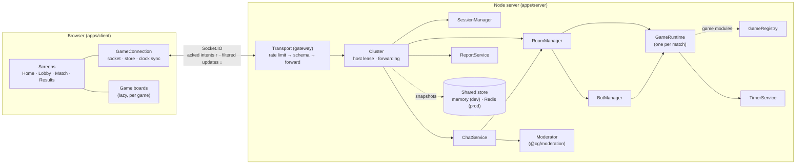
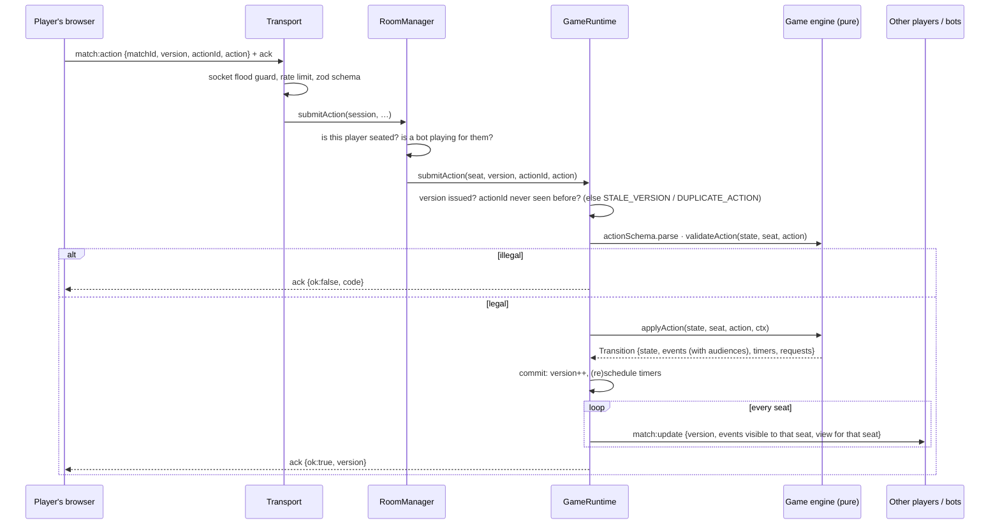

# Architecture

This document describes the system **as implemented** (Phase 1). The full approved design,
including parts not built yet, is in [specs/PHASE_0_SPEC.md](specs/PHASE_0_SPEC.md).

## Components

| Component       | Location                             | Responsibility                                                                                                                                                                                                                                                                    |
| --------------- | ------------------------------------ | --------------------------------------------------------------------------------------------------------------------------------------------------------------------------------------------------------------------------------------------------------------------------------- |
| Transport       | `apps/server/src/transport/`         | Gateway for this instance's sockets: origin check, per-IP connection cap, per-socket flood guard, per-event rate limit, zod validation; forwards each request to the host and relays its acks and messages                                                                        |
| Cluster         | `apps/server/src/cluster/`           | Host lease, gateway ↔ host forwarding, state snapshots (fenced commits), hand-over and failover; `HostServices` builds the authoritative services; `SharedStore` = memory or Redis ([ADR-023](decisions/ADR-023-multi-instance-cluster.md))                                       |
| SessionManager  | `apps/server/src/session/`           | Anonymous identities, secret tokens (stored hashed), one active socket per session, nicknames                                                                                                                                                                                     |
| RoomManager     | `apps/server/src/rooms/`             | Room lifecycle, membership, host, bots, reconnect grace, bot takeover/reclaim, match start/finish/abort                                                                                                                                                                           |
| RoomStore       | `apps/server/src/rooms/RoomStore.ts` | Room storage interface on the host; changes are snapshotted to the shared store                                                                                                                                                                                                   |
| GameRuntime     | `apps/server/src/runtime/`           | Hosts one match: runs the pure engine, schedules its timers, fans out per-seat views/events                                                                                                                                                                                       |
| GameRegistry    | `apps/server/src/runtime/`           | `gameId → GameModule`, manifest sanity checks                                                                                                                                                                                                                                     |
| BotManager      | `apps/server/src/bots/`              | Drives bot seats through the same action path as humans                                                                                                                                                                                                                           |
| ChatService     | `apps/server/src/chat/`              | Room chat pipeline and quick reactions (validated, rate-limited, fanned out with the sender's seat)                                                                                                                                                                               |
| ReportService   | `apps/server/src/reports/`           | Player reports → `ReportSink` (bounded flags in the shared store, 24 h)                                                                                                                                                                                                           |
| Moderator       | `packages/moderation`                | Text normalisation, profanity censoring, contact-detail removal, nickname checks                                                                                                                                                                                                  |
| Protocol        | `packages/protocol`                  | Event names/payload types, error codes, view types; zod schemas at `@cg/protocol/schemas` (server only)                                                                                                                                                                           |
| Game SDK        | `packages/game-sdk`                  | Game contract, seeded RNG, audience helpers, test harness, fixture game, client module types                                                                                                                                                                                      |
| Client platform | `apps/client/src/platform/`          | `GameConnection` (socket + store), clock offset, storage, action sender (ids, double-tap coalescing), animation director, effects controller                                                                                                                                      |
| Design system   | `packages/ui`                        | Color Burst Arcade tokens/styles + animated primitives shared by screens and game boards ([ADR-015](decisions/ADR-015-shared-ui-package.md))                                                                                                                                      |
| Games           | `games/<id>`                         | Each game's shared types, pure engine + bot (server) and board (client) — `games/rmcs`, `games/sixteen-parchi`, `games/draw-and-guess`, `games/pen-fight`, `games/dots-and-boxes`, `games/name-place-animal-thing`, `games/business` ([catalogue](GAME_SYSTEM.md#game-catalogue)) |

## Request path (one game action)

## Key design rules

1. **Pure engines.** Engines never use `Date.now()`, `Math.random()`, I/O or in-place
   mutation. They get `ctx.now` and a seeded `ctx.rng`. The test harness deep-freezes
   state to catch mutation. → [ADR-004](decisions/ADR-004-pure-engines-seeded-rng.md)
2. **Views + events.** Every transition sends each seat a complete filtered **view** plus
   the **events** it may see (for animation). No diff protocol. →
   [ADR-003](decisions/ADR-003-socketio-view-event-sync.md)
3. **Visibility at emission.** Engines attach an audience (`ALL`, `SEATS`, `ALL_EXCEPT`) to
   each event; the runtime delivers only matching events.
4. **One transition at a time.** `GameRuntime` runs all inputs (actions, timers, seat
   changes, chat consumption) through a synchronous queue, so re-entrant calls from hooks
   (e.g. a bot takeover requested by the engine) never interleave.
5. **Engines only know seats.** Session ids, sockets and connection state stay in the
   platform; engines hear about them through `onSeatChange`.
6. **Errors are codes.** The server never sends user-facing English; the client maps codes
   to translated messages.
7. **Replaceable edges.** `RoomStore`, `Moderator`, `ReportSink` and `SharedStore` are
   interfaces; `SharedStore` has an in-memory (development, tests) and a Redis (production)
   implementation.

## Client architecture

- `GameConnection` owns the single Socket.IO connection and an external store
  (`useSyncExternalStore`). Components read state with `useAppState()` and send requests
  with `connection.request(event, payload)`, which resolves to the server's ack (or a
  client-side `TIMEOUT`/`OFFLINE` code).
- Screens: `HomeScreen` → `RoomScreen` (`LobbyView` | `MatchView` | `ResultsView`) + `ChatPanel`.
- Game boards are lazy-loaded per game from `apps/client/src/games/registry.ts`. A game is
  offered only if both the server (`session:ready.games`) and the client registry know it.
- **Clock sync:** 5 `time:ping` round trips; the median offset converts server deadlines
  into local countdowns (`connection.msUntil(serverTs)`).
- **Game actions** go through `connection.sendAction`, which attaches a fresh `actionId`
  and coalesces an identical action still awaiting its ack (double taps).
- **Animation director:** match updates reach the director directly from the connection;
  it presents them one at a time, waiting for each update's event animations (declared by
  the game's `eventDuration`) and fast-forwarding when more than 1.5 s would pile up
  ([ADR-016](decisions/ADR-016-animation-director.md)).
- **Effects modes** `full` / `lite` / `reduced`: OS reduced motion → reduced; otherwise the
  player's Auto/Full/Lite choice (header toggle); Auto picks lite on low-end devices. The
  mode feeds Motion (`EffectsRoot`), CSS (`html[data-effects]`) and every board.

## Internationalisation

All UI text lives in `apps/client/src/i18n/en.ts`; components call `t('section.key', params)`.
Keys are type-checked (a typo is a compile error). Error codes map to `errors.<CODE>` and the
catalog is checked to cover every server error code. Game-specific text lives in each game's
client module (`messages`). Adding a language = adding a catalog with the same shape. →
[ADR-010](decisions/ADR-010-typed-i18n-catalog.md)

## Multiple instances (Phase 6)

Production runs any number of server instances (Vercel Functions) sharing state through Redis
([ADR-023](decisions/ADR-023-multi-instance-cluster.md), [deployment](DEPLOYMENT.md)):

- Every instance is a **gateway** for its own sockets (origin check, rate limits, schemas, clock
  pings) and forwards everything else.
- Exactly one instance — the holder of the `cg:host` **lease** (with an epoch) — runs the
  authoritative services above (`HostServices`) for all rooms. Requests and deliveries travel
  over per-instance Redis channels; the host's own sockets never touch Redis.
- The host writes changed sessions and rooms (runtime state, version, RNG, action ids, timer
  deadlines, grace deadlines) every 100 ms in commits **fenced by the lease**.
- An idle host hands over; a crashed host's lease expires (15 s) and another instance takes
  over, restoring rooms, timers and bots and resending state to every player.

Locally (`pnpm dev`, tests) the same code runs in one process with `MemorySharedStore`; that
process is always the host. The multi-instance tests run several instances in one process
against the memory store, and against a real Redis in CI.
