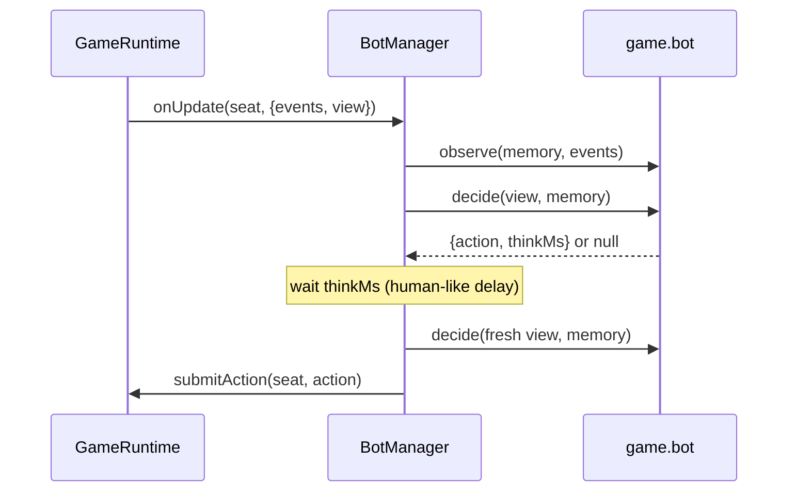

# Bot system

Implementation: `apps/server/src/bots/BotManager.ts`; each game supplies its own `bot`
module (`createMemory`, `observe`, `decide`).

## Where bots come from (Phase 1)

| Source                  | How                                                                                  |
| ----------------------- | ------------------------------------------------------------------------------------ |
| Host adds a bot         | `room:addBot` in the lobby → a bot **member** ("Bot Tiku", "Bot Chintu", …)          |
| Disconnected player     | grace period (30 s) expires during a match → **takeover** bot, reason `DISCONNECTED` |
| Idle player             | the engine requests `MARK_IDLE` after repeated timeouts → takeover, reason `IDLE`    |
| Player leaves mid-match | immediate takeover, reason `LEFT`, for the rest of the match                         |

Public-room bot fill arrives in Phase 9.

## Fairness rules

- A bot receives **exactly** what a human in its seat receives: the filtered view and the
  filtered events (`observe` is only given events visible to that seat).
- Bot moves go through the same `submitAction` → `validateAction` → `applyAction` path as
  human moves; an illegal bot move is rejected and logged, never forced through.
- Bots are always labelled: bot members have obviously-bot names and a "Bot" badge;
  takeover seats show `controller: 'BOT'` with the bot's name. Human nicknames may not
  start with "Bot" (kept by product owner decision, Phase 2 review).
- Bots never react, and never chat — except Draw & Guess guessing, which uses chat as its
  input and goes through the same game hook and moderation as a human's message.

## How a bot plays

- One pending "thought" per bot seat. After the delay the bot re-decides on the **freshest**
  view, so it never acts on stale information.
- Each bot seat has its own seeded RNG.
- When a human reclaims the seat the bot is detached and its memory discarded.
- Bot delays are game-defined (RMCS and 16 Parchi: 0.8–2.5 s, scaled by `GAME_TIME_SCALE`;
  fixture 0.6–1.2 s; tests 10–60 ms).
- **RMCS bot:** the only decision is the Mantri's guess between two players it knows nothing
  about, so it guesses uniformly at random — honest, and it never sees hidden roles.
- **16 Parchi bot** ("Normal"): chooses a slip with the spec's safe auto-pick — keep the item
  it holds most of, pass one it holds fewest of, ties at random — after 0.8–2.5 s, and claims
  a full set after 0.8–2.5 s so humans can win claim races. It only ever looks at its own
  hand (the same view a human in its seat gets); it has no memory of passed slips.
- **Draw & Guess bot:** chooses a card it has a drawing template for; draws by returning a
  `STREAM` decision — a timed plan of stroke chunks (its word's original template with small
  random wobble, spread over 20–40 s) that the `BotManager` feeds through `acceptStream`, the
  same validation a human drawer gets (a rejected chunk, e.g. the turn ended, cancels the
  rest). Guesses by returning `CHAT` — a pack word that fits the public pattern and has not
  been guessed wrong this turn — every 6–12 s, sent through `ChatService.sendFromBot`. It never
  sees the answer ([ADR-020](decisions/ADR-020-streamed-games.md)).
- **Pen Fight bot:** simulates 24 candidate shots with the same server physics (six aimed at
  each opponent, the rest random), scores each (+100 per opponent out, −250 if its own pen goes
  out, + its own distance from the edge, − the opponents'), usually plays the best, sometimes
  the 2nd or 3rd, adds human-like error (±2.5°, ±5 %) that never turns a safe shot into a
  self-elimination, and always finishes before the aim timer. Measured p50 ≈ 13 ms / p95 ≈ 17 ms per decision on
  a laptop — no worker thread
  ([ADR-022](decisions/ADR-022-pen-fight-physics.md)).
- **Dots & Boxes bot** (one level): takes every box it can (a line closing two first) and keeps
  moving; otherwise draws a safe line (gives no box its third side), preferring quiet parts of
  the board; when nothing is safe, gives away the smallest chain or loop. Mistakes: with ≤ 4
  safe lines left it plays an unsafe line 15 % of the time; in the end phase it gives a random
  chain 20 % of the time; it never misses an available box. Thinks 0.7–1.6 s (0.35–0.7 s per
  extra move in a chain); the decision itself is far below the 50 ms guard in the tests.
- **Name Place Animal Thing bot** (one level): answers from the curated answer bank for the
  round letter (at least 5 per letter and category, all passing the moderator), one category
  at a time in random order — first after 6–14 s, then every 4–11 s, squeezed to finish by
  ~80 % of the time left. Its sheet goes through the same private autosave path and the same
  automatic check as a human's. It never sees anyone else's sheet, never presses STOP, never
  votes or taps Done, and never counts toward the voting threshold. Standing in for a player
  it keeps their saved answers and fills only the blanks
  ([ADR-024](decisions/ADR-024-private-drafts-and-voting.md)).
- **Business bot** (one level): rolls after 0.6–1.4 s; buys a free place when it keeps a
  **reserve** of 150 + 25 per opponent afterwards, and always (down to 50 coins) when the city
  completes a region; develops when it keeps the reserve; at Start it develops its best city (a
  complete region first, then the dearest); 10 % of close calls (within 20 % of the reserve)
  go the other way. Thinks 0.8–2 s; same `ROLL` / `BUY` / `DEVELOP` / `SKIP` actions as people
  ([ADR-025](decisions/ADR-025-business-economy.md)). The same bot plays every seat in the
  economy simulation.
- **After a server hand-over** (production, [ADR-023](decisions/ADR-023-multi-instance-cluster.md))
  the new host re-attaches every bot seat and re-arms its thinking timer; a Draw & Guess bot's
  half-drawn template is not carried over (it stops drawing that turn).
- Bots never send quick reactions, and chat only to guess in Draw & Guess.
