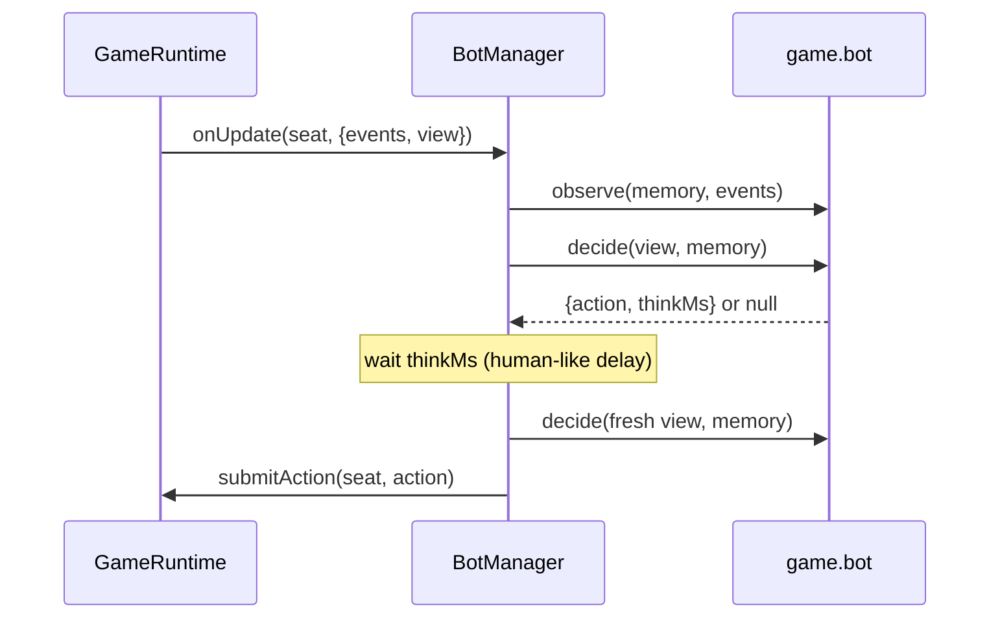

# Bot system

Implementation: `apps/server/src/bots/BotManager.ts`; each game supplies its own `bot`
module (`createMemory`, `observe`, `decide`).

## Where bots come from (Phase 1)

| Source                  | How                                                                                  |
| ----------------------- | ------------------------------------------------------------------------------------ |
| Host adds a bot         | `room:addBot` in the lobby → a bot **member** ("Bot Tiku", "Bot Chintu", …)          |
| Disconnected player     | grace period (30 s) expires during a match → **takeover** bot, reason `DISCONNECTED` |
| Idle player             | the engine requests `MARK_IDLE` after repeated timeouts → takeover, reason `IDLE`    |
| Player leaves mid-match | immediate takeover, reason `LEFT`, for the rest of the match                         |

Public-room bot fill arrives in Phase 6.

## Fairness rules

- A bot receives **exactly** what a human in its seat receives: the filtered view and the
  filtered events (`observe` is only given events visible to that seat).
- Bot moves go through the same `submitAction` → `validateAction` → `applyAction` path as
  human moves; an illegal bot move is rejected and logged, never forced through.
- Bots are always labelled: bot members have obviously-bot names and a "Bot" badge;
  takeover seats show `controller: 'BOT'` with the bot's name. Human nicknames may not
  start with "Bot" (kept by product owner decision, Phase 2 review).
- Bots never chat or react (the only planned exception is Draw & Guess guessing, which
  uses chat as its input).

## How a bot plays

- One pending "thought" per bot seat. After the delay the bot re-decides on the **freshest**
  view, so it never acts on stale information.
- Each bot seat has its own seeded RNG.
- When a human reclaims the seat the bot is detached and its memory discarded.
- Bot delays are game-defined (RMCS and 16 Parchi: 0.8–2.5 s, scaled by `GAME_TIME_SCALE`;
  fixture 0.6–1.2 s; tests 10–60 ms).
- **RMCS bot:** the only decision is the Mantri's guess between two players it knows nothing
  about, so it guesses uniformly at random — honest, and it never sees hidden roles.
- **16 Parchi bot** ("Normal"): chooses a slip with the spec's safe auto-pick — keep the item
  it holds most of, pass one it holds fewest of, ties at random — after 0.8–2.5 s, and claims
  a full set after 0.8–2.5 s so humans can win claim races. It only ever looks at its own
  hand (the same view a human in its seat gets); it has no memory of passed slips.
- Bots never chat or send quick reactions.
