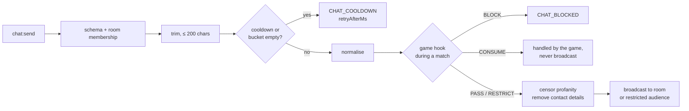

# Chat and moderation

Implementation: `apps/server/src/chat/ChatService.ts`, `apps/server/src/reports/`,
`packages/moderation/`.

## Scope (v1)

Room chat only — in the room lobby and during matches. No global chat, no direct messages.

## Pipeline

1. **Rate limit first** (per session: burst 5, refill 1/s). Emptying the bucket starts a
   **30 s cooldown**. Nobody is removed or banned for chatting. **Game input typed into the
   chat** (Draw & Guess guesses: an unsolved guesser while drawing) uses the game's own
   bucket instead (Draw & Guess: burst 8, then 1/s) — a short `RATE_LIMITED` with
   `retryAfterMs` when empty, never the cooldown, and it does not use up room-chat tokens.
   Everything after this step (game hook, censoring) is the same.
2. **Normalise** for game logic: NFKC, invisible characters removed, accents removed,
   lower case, single spaces.
3. **Game hook:** a running game may `PASS`, `RESTRICT` (deliver only to some seats on a
   named channel), `CONSUME` (the game handles it — e.g. a correct guess — and it is never
   shown) or `BLOCK` it; a `PASS` may also record public game state (Draw & Guess remembers
   wrong guesses). Only room-channel messages are kept in the history buffer. Bot guesses in
   Draw & Guess take this same path ([ADR-020](decisions/ADR-020-streamed-games.md)).
4. **Censor:** profanity is replaced with asterisks of the same length; contact details
   become `[removed]`.
5. **Broadcast** to the humans in the room (or the restricted audience plus the sender).

## What the moderator detects

`createModerator()` in `packages/moderation/src/moderator.ts` returns a `Moderator`:

| Category                               | How                                                                                                                                                    |
| -------------------------------------- | ------------------------------------------------------------------------------------------------------------------------------------------------------ |
| English profanity, sexual terms, slurs | obscenity's English dataset (with its whitelist)                                                                                                       |
| Romanised Hindi / Hinglish abuse       | our list in `datasets.ts` (incl. `bc`, `mc`, `bsdk`, …)                                                                                                |
| Insults                                | our list: stupid, idiot, dumb, moron, loser, kys, "kill yourself"                                                                                      |
| Evasion                                | obscenity transformers (confusable letters, leetspeak, repeated letters), zero-width characters removed, spaced-out letters ("f u c k", "s.t.u.p.i.d") |
| Contact details                        | URLs, `www.`, bare domains, "x dot com", emails, phone numbers (9+ digits), `@handles`, "insta: name"-style handles                                    |

**False-positive guards:** whole-word patterns; obscenity's whitelist plus our allow-list
(Classroom, class, pass, assassin, Scunthorpe, grass, cocktail, analysis, Sussex, …);
risky Hinglish words are deliberately _not_ blocked ("chod do", "saala", "kutta",
"chakka" — a six in cricket). A `!` not followed by a letter is treated as punctuation, not
leetspeak "i" (so "stupid!" is still censored while "sh!t" is still caught).

**`bc` / `mc` (product owner decision, Phase 2 review):** these are matched as whole words
only — there is deliberately no blanket abbreviation block. Words that merely contain them
pass untouched ("abc", "mcq", "BCom", "BCA", "B.C."); the accepted trade-off is that a
standalone "BC" (_before Christ_) or "MC" (_master of ceremonies_) is censored too. The
insult list follows the brief's own example ("you are stupid" → "you are ******").

## Nicknames

Nicknames use the same moderator but are **rejected** rather than censored:
2–16 characters after trimming, letters/numbers/spaces/`_ . - '`/emoji only, at least one
letter or number, no names starting with "Bot" (so a human can never pass as a bot —
confirmed by the product owner in the Phase 2 review), no profanity or contact details. Uniqueness inside a room uses a look-alike key ("Archit",
"Archít", "ARCH1T", "A r c h i t" collide).

## Mute and report

- **Mute** is client-side, per player, remembered for the browser session.
- **Report** (`report:submit`): the reporter's client immediately hides that player's
  messages. The server records `{roomId, reportedId, reporterId, reason, at}` through the
  `ReportSink` interface into a bounded in-memory store (1,000 flags, 24 h, lost on
  restart) and writes a log line without any message content. **A report never kicks,
  bans or skips anyone.**
- **Draw & Guess:** guessers can **Hide drawing** (local, per drawer; strokes keep arriving so
  un-hiding restores the picture) and **Report drawing** (reason `DRAWING`, which also hides
  the player). Words come only from the curated pack, which is tested against the moderator.
  The UI never claims drawings are moderated automatically.

## Quick reactions

A fixed set of eight emotes — 😂 😱 😤 🙏 👏 🔥 😭 🤫 (`LOL`, `SHOCK`, `ANGRY`, `PLEASE`,
`CLAP`, `FIRE`, `CRY`, `SHH`) — shown as a bubble over the sender's seat for everyone in the
match ([ADR-018](decisions/ADR-018-quick-reactions.md)).

- Only while a match is running, only from a seated player; at most **one per 1.5 s**
  (`RATE_LIMITED`). There is no free text, so nothing to moderate, and nothing is stored.
- **Only ever sent by a person.** Bots never react, and nothing reacts automatically —
  automatic reactions could leak hidden information (spec I1).
- Muting or reporting a player also hides their reactions on your screen.
- Shown in games whose board draws seat bubbles: 16 Parchi (Phase 3).

## Storage

The only chat storage is the last 50 censored room messages, in memory, deleted with the
room. It exists so reconnecting players see recent chat.

## Maintaining the word lists

Word lists are the weak point of any filter. When adding a word, add a test case in
`packages/moderation/test/moderation.test.ts` — both a must-censor case and, where
relevant, a must-not-censor case. Patterns are matched after letters are de-duplicated,
so write them in collapsed form ("gaand" → `|gand|`).

## Replacing the moderator

The server depends only on the `Moderator` interface (`normalize`, `moderate`,
`validateNickname`, `nicknameKey`) and the `ReportSink` interface. A stronger
implementation can be passed to `createGameServer({ moderator, reportSink })`.
