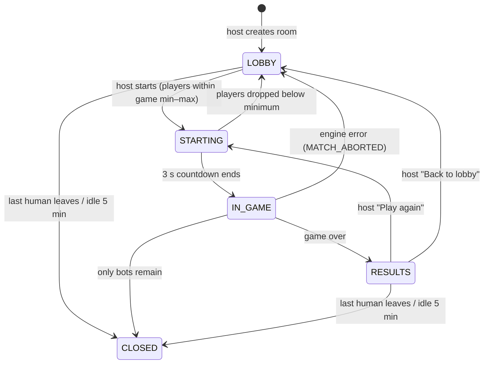

# Room system

Implementation: `apps/server/src/rooms/` (`RoomManager`, `RoomStore`, `policies.ts`,
`naming.ts`, `Matchmaker.ts`). Two kinds: **private rooms** (code + host, below) and
**public rooms** (server-created, no code, no host — matchmaking, fill window and bot fill are
described in [PUBLIC_LOBBY_SYSTEM.md](PUBLIC_LOBBY_SYSTEM.md)).

## Room model

```text
Room {
  id, kind: 'PRIVATE' | 'PUBLIC', code (null when public), gameId, settings, phase,
  hostId (null when public),
  members: (HumanMember | BotMember)[],   // join order = seat order at match start
  barred: Set<playerId>,                   // removed by the host
  match: { matchId, runtime, seats: SeatState[], results, pendingReclaims } | null,
  startsAt, chat (last 50 censored messages), noHumansSince,
  public: { fillEndsAt, loneSince, resultsEndsAt, staying } | null
}
SeatState { seat, memberId, memberKind, displayName,
            takeover: { botId, botName, reason: DISCONNECTED | IDLE | LEFT } | null,
            forfeited }
```

Room behaviour that differs by kind lives in a `RoomPolicy` (`canManage`, `isJoinable`):
`privateRoomPolicy` (the host manages; joinable in `LOBBY`) and `publicRoomPolicy` (nobody
manages — host commands answer `NOT_HOST`; joinable in `LOBBY` below the target).

## Room phases (public)

`LOBBY` (WAITING → FILLING: one fill window once `minHumans` are connected) → `STARTING`
(bots fill to the target; leaving refused) → `IN_GAME` → `RESULTS` (Play again / Leave, 15 s)
→ back to `LOBBY` with the stayers, or `CLOSED`. Details: [PUBLIC_LOBBY_SYSTEM.md](PUBLIC_LOBBY_SYSTEM.md).

## Room phases (private)



- **Create:** requires a nickname; creator becomes host; code is 6 characters from
  `ABCDEFGHJKMNPQRSTUVWXYZ23456789` (no 0/O/1/I/L), about 887 million possibilities.
  Codes are case- and space-insensitive when typed.
- **Join:** only in `LOBBY`; fails with `ROOM_NOT_FOUND`, `ROOM_FULL`, `ROOM_IN_PROGRESS`,
  `REMOVED_FROM_ROOM`, `NICKNAME_TAKEN` (look-alike names count as the same) or
  `ALREADY_IN_ROOM`. Join attempts are rate-limited per session, and wrong codes spend a
  per-IP budget (30, then one per 10 s) shared by every session from that address and counted
  once for the whole cluster (anti code-guessing; [SECURITY.md](SECURITY.md#rate-limits)).
- **Capacity:** the selected game's maximum players.
- **Host powers** (`LOBBY` unless noted): change game, change settings (validated by the
  game's schema), add/remove bots, remove players (any phase), start; from `RESULTS`:
  play again / back to lobby.
- **Removed players** are barred from that room only and told `KICKED`.
- **Host transfer:** when the host leaves or their grace period expires, the earliest-joined
  connected human becomes host (`HOST_CHANGED`). Bots are never host.

## Connection states

```mermaid
stateDiagram-v2
  [*] --> CONNECTED
  CONNECTED --> GRACE: socket lost
  GRACE --> CONNECTED: reconnects with token (within 30 s)
  GRACE --> REMOVED: grace expires (LOBBY / STARTING / RESULTS)
  GRACE --> BOT_PLAYS: grace expires (IN_GAME)
  CONNECTED --> BOT_PLAYS: engine requests MARK_IDLE
  BOT_PLAYS --> CONNECTED: reconnects (DISCONNECTED) / taps "I'm back" (IDLE)
  CONNECTED --> LEFT: leaves or is removed during a match
  LEFT --> [*]: bot keeps the seat; no reclaim this match
```



Details:

- During `GRACE` the seat is reserved; the game's own timers keep running (so the absent
  player's turns time out normally).
- A player whose grace expires **during a match** stays a member (a bot plays for them) and
  gets their seat back automatically on reconnect. When the match ends, still-absent
  players get a fresh grace period; if it expires they are removed.
- `IDLE` takeovers keep the human connected and watching; they tap **I'm back**
  (`room:reclaimSeat`). Their own actions are refused with `SEAT_CONTROLLED_BY_BOT` while a
  bot plays.
- Reclaim policy comes from the game manifest: `IMMEDIATE`, or `NEXT_PHASE_BOUNDARY`
  (the game's `canReclaimSeat` decides; pending reclaims are retried after every transition).
- Players who **leave** (or are removed) mid-match forfeit the seat to a bot for the rest of
  that match and cannot rejoin while it runs.
- When a player reconnects, the server always sends a room snapshot (or `null` if they are no
  longer in a room), the chat history and, in a match, a fresh view.

## Cleanup

- A room closes when its last human member is gone, or when **only bots remain** in a match
  (no human connected or within grace).
- A periodic sweep closes rooms that have had no connected humans for 5 minutes.
- Closing clears every timer and bot for that room.

## Limits (config)

`maxRooms` (500), `roomCreate` rate limit (burst 3, ~5/min per session), `roomJoin`
(burst 10, ~20/min), `roomAdmin` (burst 10, 2/s), `codeGuess` per IP (burst 30, one per 10 s)
— all counted on the room host for the whole cluster; public play adds `matchmaking` (burst 5,
one per 2 s) and `browse` (burst 5, 1/s) on the host, and `matchmaking.fillWindowMs` (12 s,
env `PUBLIC_FILL_WINDOW_MS`), `resultsMs` (15 s), `browseMaxRooms` (50), `browsePushMs` (250).
